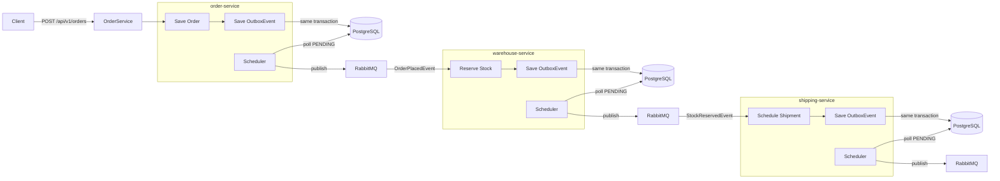

# Outbox Pattern with RabbitMQ — Order Fulfillment Case Study

This repository demonstrates a practical implementation of the **Transactional Outbox Pattern** using **RabbitMQ** and **Spring Boot** microservices.

The focus is on solving a real-world production problem:

> How do you guarantee that a database write and a message publish either both succeed or both fail — with no data loss?

---

## The Problem

In a distributed system, this is a common and dangerous pattern:

```java
// Step 1 — save to DB
orderRepository.save(order);

// Step 2 — publish to RabbitMQ
rabbitTemplate.convertAndSend(exchange, routingKey, event);
```

If Step 1 succeeds and Step 2 fails:
- The order exists in the DB
- The warehouse never receives the event
- The order is stuck forever
- The customer never gets their package

This is a real production problem that has caused data inconsistencies in many systems.

---

## The Solution — Outbox Pattern

Instead of publishing directly to RabbitMQ, the event is saved into an `outbox_events` table **in the same transaction** as the business data.

A scheduler then polls the `outbox_events` table and publishes the events to RabbitMQ.

Step 1 — same transaction:

- save business data to DB
- save event to outbox_events table

Step 2 — scheduler (runs every 5 seconds):

- poll outbox_events where status = PENDING
- publish to RabbitMQ
- mark as PUBLISHED

This guarantees that:
- If the DB transaction fails → no event is saved → no duplicate message
- If RabbitMQ is down → events stay PENDING → scheduler retries later
- No message is ever lost

---

## Overview

The system consists of three microservices simulating an order fulfillment flow:

- **order-service**
  - accepts order creation requests
  - saves order data in **PostgreSQL**
  - saves `OrderPlacedEvent` in `outbox_events` table
  - scheduler publishes event to RabbitMQ

- **warehouse-service**
  - consumes `OrderPlacedEvent` from RabbitMQ
  - reserves stock in **PostgreSQL**
  - saves `StockReservedEvent` in `outbox_events` table
  - scheduler publishes event to RabbitMQ

- **shipping-service**
  - consumes `StockReservedEvent` from RabbitMQ
  - schedules shipment in **PostgreSQL**
  - saves `ShipmentScheduledEvent` in `outbox_events` table
  - scheduler publishes event to RabbitMQ

---

## Architecture Diagram



---

## Event Flow

1. Client sends `POST /api/v1/orders` to order-service.
2. order-service saves the order and an `OrderPlacedEvent` in the same DB transaction.
3. order-service scheduler polls `outbox_events` and publishes `OrderPlacedEvent` to RabbitMQ.
4. warehouse-service consumes `OrderPlacedEvent` and reserves stock.
5. warehouse-service saves the reservation and a `StockReservedEvent` in the same DB transaction.
6. warehouse-service scheduler polls `outbox_events` and publishes `StockReservedEvent` to RabbitMQ.
7. shipping-service consumes `StockReservedEvent` and schedules a shipment.
8. shipping-service saves the shipment and a `ShipmentScheduledEvent` in the same DB transaction.
9. shipping-service scheduler polls `outbox_events` and publishes `ShipmentScheduledEvent` to RabbitMQ.

---

## Outbox Event Statuses

| Status | Meaning |
|---|---|
| `PENDING` | Event saved, not yet published |
| `PUBLISHED` | Event successfully published to RabbitMQ |
| `FAILED` | Publish attempt failed |

---

## Tech Stack

- Java 21
- Spring Boot 4
- Spring Data JPA
- RabbitMQ
- PostgreSQL
- Kubernetes (Minikube)
- Ingress NGINX
- Docker
- JUnit 5
- Testcontainers
- MapStruct
- Lombok

---

## Project Structure

```text
rabbitmq-outbox-order-fulfilment/
├── order-service/
├── warehouse-service/
├── shipping-service/
└── k8s/
    ├── 00-namespace.yaml
    ├── 01-secrets.yaml
    ├── 02-configmaps.yaml
    ├── 03-rabbitmq.yaml
    ├── 04-postgres-order.yaml
    ├── 05-postgres-warehouse.yaml
    ├── 06-postgres-shipping.yaml
    ├── 07-order-service.yaml
    ├── 08-warehouse-service.yaml
    ├── 09-shipping-service.yaml
    └── 10-ingress.yaml
```

---

## Running the Project

Make sure Docker Desktop and Minikube are installed and running.

### 1. Start Minikube

```bash
minikube start
```

### 2. Enable Ingress Addon

```bash
minikube addons enable ingress
```

### 3. Configure Docker Environment

Linux / Mac:
```bash
eval $(minikube docker-env)
```

Windows (PowerShell):
```bash
& minikube -p minikube docker-env --shell powershell | Invoke-Expression
```

### 4. Build Docker Images

```bash
docker build -t order-service:latest ./order-service
docker build -t warehouse-service:latest ./warehouse-service
docker build -t shipping-service:latest ./shipping-service
```

### 5. Deploy to Kubernetes

```bash
kubectl apply -f k8s/
```

### 6. Verify Deployment

Check pods:
```bash
kubectl get pods -n rabbitmq-outbox
```

Check services:
```bash
kubectl get svc -n rabbitmq-outbox
```

### 7. Add Host Entry

Get Minikube IP:
```bash
minikube ip
```

Add to your hosts file:

<minikube-ip>  rabbitmq-outbox.local

On Linux/Mac: `/etc/hosts`
On Windows: `C:\Windows\System32\drivers\etc\hosts`

### 8. Trace the Logs

```bash
kubectl logs deployment/order-service -n rabbitmq-outbox -f
kubectl logs deployment/warehouse-service -n rabbitmq-outbox -f
kubectl logs deployment/shipping-service -n rabbitmq-outbox -f
```

### 9. Stop / Remove

```bash
kubectl delete -f k8s/
minikube stop
```

---

## Service URLs

### Via Ingress (after adding host entry)

| Service | URL |
|---|---|
| order-service | `http://rabbitmq-outbox.local/api/v1/orders` |
| warehouse-service | `http://rabbitmq-outbox.local/api/v1/stocks` |
| shipping-service | `http://rabbitmq-outbox.local/api/v1/shipments` |

### RabbitMQ Management UI

```bash
kubectl port-forward svc/rabbitmq 15672:15672 -n rabbitmq-outbox
```

Then open: `http://localhost:15672`

Default credentials:
username: guest
password: guest

---

## API Endpoints

### order-service

```http
POST   /api/v1/orders
GET    /api/v1/orders/{orderId}
GET    /api/v1/orders
```

### warehouse-service

```http
POST   /api/v1/stocks
GET    /api/v1/stocks
```

### shipping-service

```http
GET    /api/v1/shipments/{shipmentId}
GET    /api/v1/shipments
```

---

## Curl Samples

### Create Stock (run before placing orders)

```bash
curl --location 'http://rabbitmq-outbox.local/api/v1/stocks' \
--header 'Content-Type: application/json' \
--data '{
    "productId": "PROD-001",
    "productName": "Wireless Headphones",
    "availableQuantity": 100
}'
```

### Place Order

```bash
curl --location 'http://rabbitmq-outbox.local/api/v1/orders' \
--header 'Content-Type: application/json' \
--data '{
    "customerId": "CST-001",
    "customerEmail": "customer@email.com",
    "deliveryAddress": "123 Main St, Cairo, Egypt",
    "currency": "USD",
    "items": [
        {
            "productId": "PROD-001",
            "productName": "Wireless Headphones",
            "quantity": 2,
            "unitPrice": 99.99
        }
    ]
}'
```

### Get All Orders

```bash
curl --location 'http://rabbitmq-outbox.local/api/v1/orders'
```

### Get All Stocks

```bash
curl --location 'http://rabbitmq-outbox.local/api/v1/stocks'
```

### Get All Shipments

```bash
curl --location 'http://rabbitmq-outbox.local/api/v1/shipments'
```

---

## Testing

The project contains automated tests including:

- unit tests for service layer logic
- unit tests for outbox event saving behavior
- integration tests for controller endpoints
- Testcontainers-based tests for database-backed integration scenarios

---

## Why This Project Matters

The Outbox Pattern solves one of the most common and dangerous problems in distributed systems — guaranteed message delivery without dual-write inconsistency.

This project demonstrates:

- Atomicity between DB write and event publishing
- Resilience when RabbitMQ is temporarily unavailable
- Clean separation of business logic and messaging concerns
- Production-ready event flow across three independent services
- Each service owns its own database — no shared state