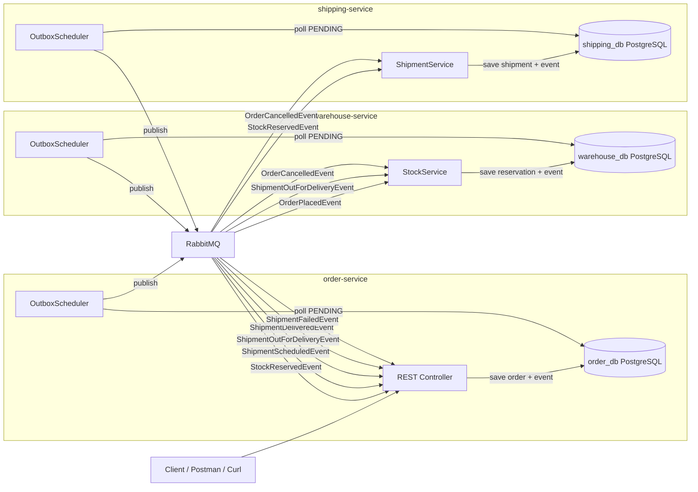

# RabbitMQ Outbox Pattern — Order Fulfillment Case Study

This repository demonstrates a practical implementation of the **Transactional Outbox Pattern** using **RabbitMQ** and **Spring Boot** microservices.

The focus is on solving a real-world production problem:

> How do you guarantee that a database write and a message publish either both succeed or both fail — with no data loss?

---

## The Problem

In a distributed system, this is a common and dangerous pattern:

```java
// Step 1 — save to DB
orderRepository.save(order);

// Step 2 — publish to RabbitMQ
rabbitTemplate.convertAndSend(exchange, routingKey, event);
```

If Step 1 succeeds and Step 2 fails:
- The order exists in the DB
- The warehouse never receives the event
- The order is stuck forever
- The customer never gets their package

This is a real production problem that has caused data inconsistencies in many systems.

---

## The Solution — Outbox Pattern

Instead of publishing directly to RabbitMQ, the event is saved into an `outbox_events` table **in the same transaction** as the business data.

A scheduler then polls the `outbox_events` table and publishes the events to RabbitMQ.

**Step 1 — same transaction:**
- Save business data to DB
- Save event to `outbox_events` table

**Step 2 — scheduler (runs every 5 seconds):**
- Poll `outbox_events` where `status = PENDING`
- Publish to RabbitMQ
- Mark as `PUBLISHED`

This guarantees that:
- If the DB transaction fails → no event is saved → no duplicate message
- If RabbitMQ is down → events stay `PENDING` → scheduler retries on next poll
- If the consumer fails to process a message → it is retried up to a configured max attempts
- If max retries are exhausted → message is routed to the **Dead Letter Queue (DLQ)** for inspection and manual recovery
- No message is ever silently lost

---

## Overview

The system consists of three microservices simulating an order fulfillment flow:

- **order-service**
  - exposes REST APIs for placing ,cancelling and viewing orders
  - saves order data in **PostgreSQL**
  - saves `OrderPlacedEvent` or `OrderCancelledEvent` in `outbox_events` in the same transaction
  - scheduler publishes events to RabbitMQ
  - consumes incoming events to update order status throughout its lifecycle

- **warehouse-service**
  - exposes REST APIs for creating and viewing stocks
  - saves stock data in **PostgreSQL**
  - consumes `OrderPlacedEvent` → reserves stock
  - consumes `OrderCancelledEvent` → releases reserved stock
  - consumes `ShipmentOutForDeliveryEvent` → fulfills stock
  - tracks each reservation in `stock_reservations` table with full audit fields
  - saves `StockReservedEvent` in `outbox_events` in the same transaction
  - scheduler publishes events to RabbitMQ

- **shipping-service**
  - exposes REST APIs for dispatching, delivering, and failing shipments
  - saves shipment data in **PostgreSQL**
  - consumes `StockReservedEvent` → schedules shipment
  - consumes `OrderCancelledEvent` → cancels scheduled shipment
  - saves shipment events in `outbox_events` in the same transaction
  - scheduler publishes events to RabbitMQ

---

## Architecture Diagram



---

## 🔄 Event Flows

### Happy Path

1. Client sends `POST /api/v1/orders` to order-service.
2. order-service saves order (`PENDING`) and `OrderPlacedEvent` in the same DB transaction.
3. OutboxScheduler publishes `OrderPlacedEvent` to RabbitMQ.
4. warehouse-service consumes `OrderPlacedEvent`, reserves stock, saves `StockReservedEvent` in the same transaction.
5. OutboxScheduler publishes `StockReservedEvent` to RabbitMQ.
6. order-service consumes `StockReservedEvent` → order status becomes `CONFIRMED`.
7. shipping-service consumes `StockReservedEvent`, schedules shipment, saves `ShipmentScheduledEvent` in the same transaction.
8. OutboxScheduler publishes `ShipmentScheduledEvent` to RabbitMQ.
9. order-service consumes `ShipmentScheduledEvent` → order status becomes `SHIPPED`.
10. Courier calls `PATCH /api/v1/shipments/{id}/dispatch`.
11. shipping-service saves `ShipmentOutForDeliveryEvent` in the same transaction.
12. OutboxScheduler publishes `ShipmentOutForDeliveryEvent` to RabbitMQ.
13. order-service consumes it → order status becomes `OUT_FOR_DELIVERY`.
14. warehouse-service consumes it → stock reservation fulfilled (reserved quantity decremented).
15. Courier calls `PATCH /api/v1/shipments/{id}/deliver`.
16. shipping-service saves `ShipmentDeliveredEvent` in the same transaction.
17. OutboxScheduler publishes `ShipmentDeliveredEvent` to RabbitMQ.
18. order-service consumes it → order status becomes `DELIVERED`.

---

### Cancellation Flow

1. Client calls `PATCH /api/v1/orders/{id}/cancel` — allowed only when order is `PENDING`, `CONFIRMED`, or `SHIPPED`.
2. order-service saves order (`CANCELLED`) and `OrderCancelledEvent` in the same DB transaction.
3. OutboxScheduler publishes `OrderCancelledEvent` to RabbitMQ.
4. warehouse-service consumes it → releases reserved stock back to available.
5. shipping-service consumes it → cancels the scheduled shipment.

---

### Failure Flow

1. Courier calls `PATCH /api/v1/shipments/{id}/fail`.
2. shipping-service saves `ShipmentFailedEvent` in the same transaction.
3. OutboxScheduler publishes `ShipmentFailedEvent` to RabbitMQ.
4. order-service consumes it → order status becomes `FAILED`.

---

## Statuses

### Order Statuses

| Status | Meaning |
|---|---|
| `PENDING` | Order created, waiting for stock reservation |
| `CONFIRMED` | Stock reserved by warehouse |
| `SHIPPED` | Shipment scheduled, waiting for courier pickup |
| `OUT_FOR_DELIVERY` | Courier picked up, on the way to customer |
| `DELIVERED` | Customer received the order |
| `CANCELLED` | Order cancelled — only allowed before `OUT_FOR_DELIVERY` |
| `FAILED` | Shipment delivery failed |
...

### Shipment Statuses

| Status | Meaning |
|---|---|
| `SCHEDULED` | Shipment created, waiting for courier |
| `OUT_FOR_DELIVERY` | Courier picked up, on the way |
| `DELIVERED` | Delivered to customer |
| `CANCELLED` | Cancelled due to order cancellation |
| `FAILED` | Delivery failed |
...

### Outbox Event Statuses

| Status | Meaning |
|---|---|
| `PENDING` | Event saved, not yet published |
| `PUBLISHED` | Event successfully published to RabbitMQ |
| `FAILED` | Publish attempt failed |

---

## Tech Stack

- Java 21
- Spring Boot 4
- Spring Data JPA
- RabbitMQ
- PostgreSQL
- Kubernetes (Minikube)
- Ingress NGINX
- Docker
- JUnit 5
- Testcontainers
- MapStruct
- Lombok

---

## Project Structure

```text
rabbitmq-outbox-order-fulfilment/
├── README.md
├── rabbitmq-outbox-order-fulfilment.postman_collection.json
├── order-service/
│   └── TESTING.md
├── warehouse-service/
│   └── TESTING.md
├── shipping-service/
│   └── TESTING.md
└── k8s/
    ├── 00-namespace.yaml
    ├── 01-secrets.yaml
    ├── 02-configmaps.yaml
    ├── 03-rabbitmq.yaml
    ├── 04-postgres-order.yaml
    ├── 05-postgres-warehouse.yaml
    ├── 06-postgres-shipping.yaml
    ├── 07-order-service.yaml
    ├── 08-warehouse-service.yaml
    ├── 09-shipping-service.yaml
    └── 10-ingress.yaml
```

---

## Running the Project

Make sure Docker Desktop, Minikube, kubectl, Java 21, and Maven are installed and running.

### 1. Start Minikube

```bash
minikube start
```

Verify cluster:

```bash
kubectl get nodes
```

### 2. Enable Ingress Addon

```bash
minikube addons enable ingress
```

### 3. Configure Docker Environment

This step points your shell to Minikube's internal Docker daemon so that images built in the next steps are available to Kubernetes.

> ⚠️ **Important:** Steps 4 and 5 must be run in the **same terminal session** as this step. If you close the terminal or open a new one, you must run this command again before building images.

Linux / Mac:

```bash
eval $(minikube docker-env)
```

Windows (PowerShell only — do not use CMD):

```powershell
& minikube -p minikube docker-env --shell powershell | Invoke-Expression
```

Verify you are pointing to Minikube's daemon:

```bash
docker images
```

You should see Minikube internal images like `registry.k8s.io/pause` and `registry.k8s.io/coredns`. You should **not** see `gcr.io/k8s-minikube/kicbase` — if you do, the command did not work and you are still pointing to Docker Desktop.

### 4. Build JAR Files

Run from the root folder of the project in the **same terminal session**:

Linux / Mac:

```bash
cd order-service && mvn clean package -DskipTests && cd ..
cd warehouse-service && mvn clean package -DskipTests && cd ..
cd shipping-service && mvn clean package -DskipTests && cd ..
```

Windows (PowerShell):

```powershell
cd order-service; mvn clean package -DskipTests; cd ..
cd warehouse-service; mvn clean package -DskipTests; cd ..
cd shipping-service; mvn clean package -DskipTests; cd ..
```

### 5. Build Docker Images

Run in the **same terminal session** as Step 3:

```bash
docker build -t order-service:latest ./order-service
docker build -t warehouse-service:latest ./warehouse-service
docker build -t shipping-service:latest ./shipping-service
```

Verify images are available inside Minikube:

Linux / Mac:

```bash
docker images | grep service
```

Windows (PowerShell):

```powershell
docker images | Select-String "service"
```

You should see `order-service`, `warehouse-service`, and `shipping-service` in the list.

### 6. Deploy to Kubernetes

```bash
kubectl apply -f k8s/
```

### 7. Verify Deployment

Check pods:

```bash
kubectl get pods -n rabbitmq-outbox
```

All pods should show `Running` status. If any pod shows `ErrImageNeverPull` it means Step 3 was not run in the same terminal session as Steps 4 and 5 — go back to Step 3 and repeat Steps 3, 4, and 5 in the same terminal.

Check services:

```bash
kubectl get svc -n rabbitmq-outbox
```

### 8. Add Host Entry

**Linux / Mac:**

Get Minikube IP:

```bash
minikube ip
```

Add to `/etc/hosts` (requires sudo):
<minikube-ip>  rabbitmq-outbox.local

**Windows:**

Add to `C:\Windows\System32\drivers\etc\hosts` (open Notepad as Administrator):
127.0.0.1  rabbitmq-outbox.local

---

**Windows users only — Run Minikube Tunnel:**

Minikube on Windows with the Docker driver requires an active tunnel to make the Ingress accessible from your machine.

Open a **new PowerShell window as Administrator** and run:

```powershell
minikube tunnel
```

> ⚠️ Keep this window open while testing. Closing it will stop the tunnel and the Ingress will become unreachable again.

---

### 9. Trace the Logs

```bash
kubectl logs deployment/order-service -n rabbitmq-outbox -f
kubectl logs deployment/warehouse-service -n rabbitmq-outbox -f
kubectl logs deployment/shipping-service -n rabbitmq-outbox -f
```

### 10. Stop / Remove

```bash
kubectl delete -f k8s/
minikube stop
```

---

## Service URLs

### Via Ingress

All platforms after completing Step 8:

| Service | URL |
|---|---|
| order-service | `http://rabbitmq-outbox.local/api/v1/orders` |
| warehouse-service | `http://rabbitmq-outbox.local/api/v1/stocks` |
| shipping-service | `http://rabbitmq-outbox.local/api/v1/shipments` |

### Via Port Forward (alternative)

If Ingress is not accessible, use port-forward as an alternative — run each in a separate terminal:

```bash
kubectl port-forward svc/order-service 8021:8021 -n rabbitmq-outbox
kubectl port-forward svc/warehouse-service 8023:8023 -n rabbitmq-outbox
kubectl port-forward svc/shipping-service 8022:8022 -n rabbitmq-outbox
```

Then access via:

| Service | URL |
|---|---|
| order-service | `http://localhost:8021` |
| warehouse-service | `http://localhost:8023` |
| shipping-service | `http://localhost:8022` |

### RabbitMQ Management UI

```bash
kubectl port-forward svc/rabbitmq 15672:15672 -n rabbitmq-outbox
```

Then open:

```text
http://localhost:15672
```

Default credentials:

```text
username: guest
password: guest
```

---

## API Endpoints

### order-service Endpoints

Place Order

```http
POST /api/v1/orders
```

Cancel Order

```http
PATCH /api/v1/orders/{orderId}/cancel
```

Get Order By Id

```http
GET /api/v1/orders/{orderId}
```

Get All Orders

```http
GET /api/v1/orders
```

### warehouse-service Endpoints

Create Stock

```http
POST /api/v1/stocks
```

Get All Stocks

```http
GET /api/v1/stocks
```

### shipping-service Endpoints

Dispatch Shipment

```http
PATCH /api/v1/shipments/{shipmentId}/dispatch
```

Deliver Shipment

```http
PATCH /api/v1/shipments/{shipmentId}/deliver
```

Fail Shipment

```http
PATCH /api/v1/shipments/{shipmentId}/fail
```

Get Shipment By Id

```http
GET /api/v1/shipments/{shipmentId}
```

Get All Shipments

```http
GET /api/v1/shipments
```

---

## Curl Samples

### warehouse-service

#### Create Stock

```bash
curl --location 'http://rabbitmq-outbox.local/api/v1/stocks' \
--header 'Content-Type: application/json' \
--data '{
    "productId": "PROD-001",
    "productName": "Wireless Headphones",
    "availableQuantity": 100
}'
```

#### Get All Stocks

```bash
curl --location 'http://rabbitmq-outbox.local/api/v1/stocks'
```

---

### order-service

#### Place Order

```bash
curl --location 'http://rabbitmq-outbox.local/api/v1/orders' \
--header 'Content-Type: application/json' \
--data '{
    "customerId": "CST-001",
    "customerEmail": "customer@email.com",
    "deliveryAddress": "123 Main St, Cairo, Egypt",
    "currency": "USD",
    "items": [
        {
            "productId": "PROD-001",
            "productName": "Wireless Headphones",
            "quantity": 2,
            "unitPrice": 99.99
        }
    ]
}'
```

#### Cancel Order

```bash
curl --location --request PATCH \
'http://rabbitmq-outbox.local/api/v1/orders/{orderId}/cancel'
```

#### Get Order By Id

```bash
curl --location 'http://rabbitmq-outbox.local/api/v1/orders/{orderId}'
```

#### Get All Orders

```bash
curl --location 'http://rabbitmq-outbox.local/api/v1/orders'
```

---

### shipping-service

#### Dispatch Shipment

```bash
curl --location --request PATCH \
'http://rabbitmq-outbox.local/api/v1/shipments/{shipmentId}/dispatch'
```

#### Deliver Shipment

```bash
curl --location --request PATCH \
'http://rabbitmq-outbox.local/api/v1/shipments/{shipmentId}/deliver'
```

#### Fail Shipment

```bash
curl --location --request PATCH \
'http://rabbitmq-outbox.local/api/v1/shipments/{shipmentId}/fail' \
--header 'Content-Type: application/json' \
--data '{
    "failureReason": "Delivery address not found"
}'
```

#### Get Shipment By Id

```bash
curl --location 'http://rabbitmq-outbox.local/api/v1/shipments/{shipmentId}'
```

#### Get All Shipments

```bash
curl --location 'http://rabbitmq-outbox.local/api/v1/shipments'
```

---

## Testing

The project contains automated tests for all three services.

Each service has a dedicated `TESTING.md` documenting the full test coverage.

Tests include:

- unit tests for service layer logic
- unit tests for outbox event saving behavior
- unit tests for consumer message handling (ack/nack/retry/DLQ)
- unit tests for outbox publisher strategy delegation
- unit tests for outbox scheduler behavior
- integration tests for controller endpoints using Testcontainers

---

## Known Simplifications

This project intentionally simplifies certain real-world concerns to stay focused on the Outbox Pattern:

- **Cancellation** is only allowed before `OUT_FOR_DELIVERY`. A full return flow where a courier returns the package to the warehouse is not implemented.
- **Outbox scheduler** uses simple polling every 5 seconds. Production systems typically use CDC tools like Debezium for lower latency and better scalability.
- **Consumer idempotency** is not implemented. In production, consumers should handle duplicate messages gracefully.

---

## Why This Project Matters

The Outbox Pattern solves one of the most common and dangerous problems in distributed systems — guaranteed message delivery without dual-write inconsistency.

This project demonstrates:

- atomicity between DB write and event publishing
- resilience when RabbitMQ is temporarily unavailable
- clean separation of business logic and messaging concerns
- full event-driven status lifecycle across three independent services
- each service owns its own database — no shared state
- stock reservation audit trail with before/after quantity snapshots
- Dead Letter Queue (DLQ) handling for failed message processing
- manual acknowledgment (MANUAL ACK) for reliable message consumption
- retry vs non-retryable failure classification in consumers
